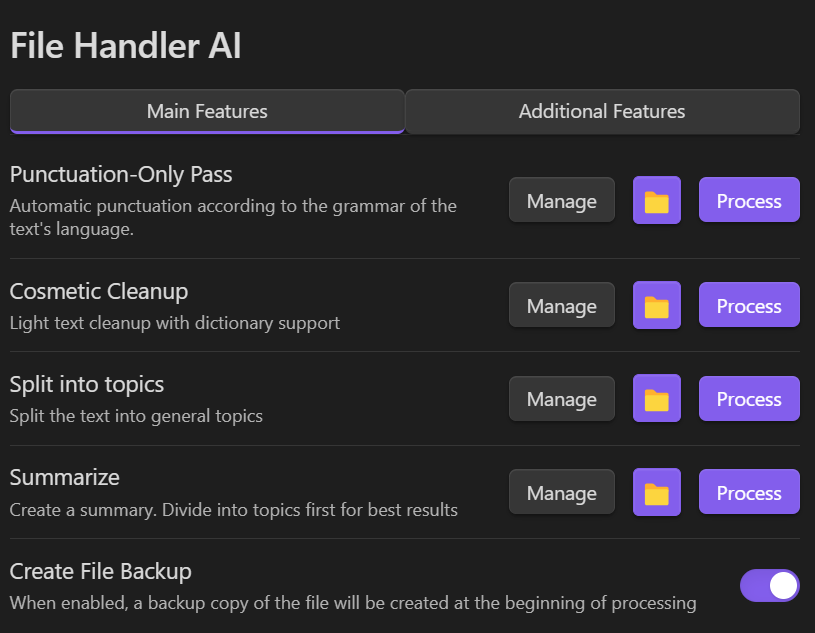

# Obsidian GPT text processing

The plugin leverages the OpenAI GPT API to both separate text by topic and summarize it.




## Installation

**1. Download the last release from the [GitHub releases](https://github.com/Nit31/obsidian-gpt-text-processing/releases)**

You should download only `main.js` & `package.json` files.

**2. Put the downloaded files to the plugin directory inside your vault**

File structure should look like this:
```
/path-to-vault/.obsidian/plugins/obsidian-gpt-text-processing/main.js
/path-to-vault/.obsidian/plugins/obsidian-gpt-text-processing/package.json
```

**3. Enable the plugin**
- In Obsidian, open Settings.
- In the side menu, select Community plugins.
- Select Turn on community plugins.
- Under Installed plugins, enable the `GPT processing` plugin by selecting the toggle button next to it.

## Getting started

Install and enable the plugin in Obsidian. Next, proceed to the plugin settings and enter your OpenAI API key.

You can open the plugin modal through the editor or the file settings.

## How it works

For topic separation, the plugin utilizes a chunking method with overlap, ensuring smooth transitions between sections.

For summarization, the plugin groups text into topic-based chunks. A new chunk begins once the previous one is complete.
The summaries from previous chunks are iteratively summarized, continuing until only a single summary remains.

## Manual build

**Pre-requisites**
- git
- npm

**1. Download the plugin**

- Go to the plugin directory
```
cd path/to/vault
mkdir .obsidian/plugins
cd .obsidian/plugins
```

- Clone the repository
```
git clone https://github.com/Nit31/obsidian-gpt-text-processing.git
```

**2. Build the plugin**
- Go to the plugin directory
```
cd obsidian-gpt-text-processing
```

- Install the plugin dependencies
```
npm install
```

- Build the plugin
```
npm run build
```

**3. Enable the plugin**


- In Obsidian, open Settings.
- In the side menu, select Community plugins.
- Select Turn on community plugins.
- Under Installed plugins, enable the `GPT processing` plugin by selecting the toggle button next to it.

## Debugging

To enable debugging, toggle the corresponding option in the plugin settings.

After each run of the plugin, the plugin will append the log files in `/user-directory/.obsidian/logs/`

You can trace errors and logs in the console. Open it with `Ctrl+Shift+I` (`Cmd+Option+I` on macOS)
